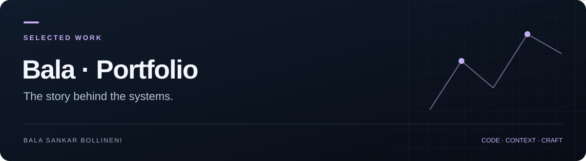

**[Project guide](docs/SHOWCASE.md)** · [Source](https://github.com/BalaShankar9/My-portfolio) · [Issues](https://github.com/BalaShankar9/My-portfolio/issues) · [Bala's work](https://github.com/BalaShankar9)

> **Current stage:** Portfolio implementation · deployment verification pending. [See the evidence and next release checklist](docs/SHOWCASE.md).

# Bala Sankar Bollineni · Portfolio

A personal portfolio presenting software projects, engineering context and ways to collaborate. Built with Next.js, React, TypeScript, Tailwind CSS and Framer Motion.

## Explore

| Area | Source |
| --- | --- |
| Homepage | [app/page.tsx](app/page.tsx) |
| Project catalogue | [lib/projects.ts](lib/projects.ts) |
| Project case-study routes | [app/projects](app/projects) |
| Page sections and interface components | [components](components) |
| Existing project captures | [public/screenshots](public/screenshots) |

## Run locally

```bash
git clone https://github.com/BalaShankar9/My-portfolio.git
cd My-portfolio
npm ci
npm run dev
```

Open `http://localhost:3000`. The exact framework versions and available scripts are recorded in [package.json](package.json) and the lockfile.

## Verify a change

```bash
npm run lint
npm run build
```

After building, `npm start` serves the production build locally. Check mobile layout, keyboard navigation, project links and contact routes before publishing.

## Content standard

Each featured project should explain the problem, intended user, implementation, one meaningful tradeoff and the evidence for its current status. Screenshots are interface illustrations; any displayed usage or performance figures need a separately dated source.

[GitHub profile](https://github.com/BalaShankar9) · [Project guide](docs/SHOWCASE.md)
